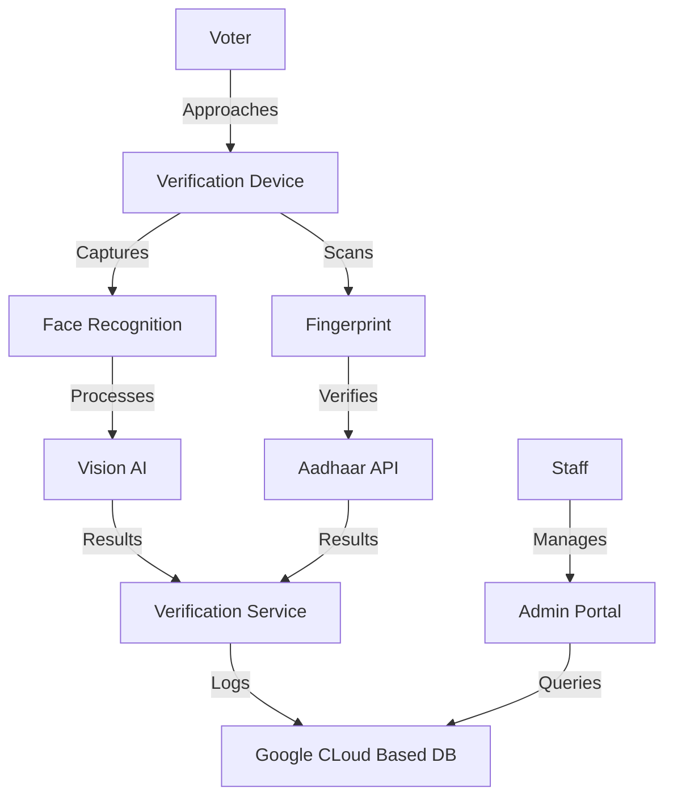

# VoteX: AI-Powered Voter Verification System


VoteX is a cutting-edge voter verification system that leverages AI and biometric technology to streamline the electoral process while maintaining the highest security standards.

## 🚀 Key Features

- **AI-Powered Face Recognition**: Real-time facial verification using advanced Vision AI
- **Biometric Authentication**: Secure fingerprint scanning integrated with Aadhaar API
- **Staff Management Portal**: Comprehensive dashboard for electoral staff
- **Real-time Analytics**: Live verification statistics and monitoring
- **Secure Database**: End-to-end encrypted data storage with row-level security
- **Audit Logging**: Complete verification attempt tracking

## 🛠️ Technology Stack

- **Frontend**: React + TypeScript + Vite
- **Styling**: Tailwind CSS
- **Icons**: Lucide React
- **Database**: Supabase (PostgreSQL)
- **Authentication**: Supabase Auth
- **API Integration**: REST APIs
- **State Management**: React Hooks
- **Type Safety**: TypeScript

## 📋 Prerequisites

- Node.js 18.x or higher
- npm 9.x or higher
- Supabase account
- Modern web browser

## 🚦 Quick Start

1. Clone the repository:

   ```bash
   git clone https://github.com/your-org/votex.git
   cd votex
   ```

2. Install dependencies:

   ```bash
   npm install
   ```

3. Set up environment variables:

   ```bash
   cp .env.example .env
   ```

   Update the following variables in `.env`:

   ```
   VITE_SUPABASE_URL=your_supabase_url
   VITE_SUPABASE_ANON_KEY=your_supabase_anon_key
   ```

4. Start the development server:

   ```bash
   npm run dev
   ```

5. Open [http://localhost:5173](http://localhost:5173) in your browser

## 🏗️ Architecture Overview

### System Components



### Database Schema

#### Voters Table

- `id`: UUID (Primary Key)
- `aadhaar_id`: Text (Unique)
- `full_name`: Text
- `face_data`: JSONB
- `biometric_data`: JSONB
- `electoral_roll_number`: Text
- `region_code`: Text
- `created_at`: Timestamp
- `updated_at`: Timestamp

#### Verification Logs Table

- `id`: UUID (Primary Key)
- `voter_id`: UUID (Foreign Key)
- `verification_type`: Text ('face' | 'fingerprint')
- `status`: Text ('success' | 'failed')
- `error_message`: Text
- `verified_by_staff`: Boolean
- `staff_id`: UUID
- `created_at`: Timestamp

## 🔒 Security Features

- Row Level Security (RLS) policies
- Encrypted data storage
- Secure authentication
- Audit logging
- Rate limiting
- Input validation

## 📦 Deployment

1. Build the project:

   ```bash
   npm run build
   ```

2. Deploy to your hosting platform:

   ```bash
   # Example for Netlify
   netlify deploy --prod
   ```

## 📚 Additional Resources

- [Supabase Documentation](https://supabase.com/docs)
- [React Documentation](https://react.dev)
- [Tailwind CSS Documentation](https://tailwindcss.com/docs)
- [TypeScript Documentation](https://www.typescriptlang.org/docs)

## 📄 License

This project is licensed under the MIT License - see the [LICENSE](LICENSE) file for details.

## 🤝 Contributing

Please read [COLLABORATION.md](COLLABORATION.md) for details on our code of conduct and the process for submitting pull requests.

## Setup

1. Clone the repository
2. Install dependencies:

```bash
npm install
```

3. Copy `.env.example` to `.env` and fill in your Firebase configuration:

```bash
cp .env.example .env
```

4. Set up Firebase:
   - Create a new Firebase project at [Firebase Console](https://console.firebase.google.com)
   - Enable Authentication, Firestore, and Hosting
   - Copy the Firebase configuration values to your `.env` file

## Local Development

1. Start the development server:

```bash
npm run dev
```

2. Start Firebase emulators (optional, for testing Firebase features locally):

```bash
npm run firebase:emulators
```

The app will be available at <http://localhost:3000>

## Production Deployment

1. Install Firebase CLI if you haven't:

```bash
npm install -g firebase-tools
```

2. Login to Firebase:

```bash
firebase login
```

3. Initialize Firebase (first time only):

```bash
firebase init
```

4. Deploy to Firebase:

```bash
npm run deploy
```

This will build the application and deploy it to Firebase Hosting.

## Available Scripts

- `npm run dev` - Start development server
- `npm run build` - Build for production
- `npm run preview` - Preview production build locally
- `npm test` - Run tests
- `npm run firebase:emulators` - Start Firebase emulators
- `npm run firebase:deploy` - Deploy to Firebase
- `npm run deploy` - Build and deploy to Firebase

## Environment Variables

Create a `.env` file with the following variables:

```env
PORT=3000
NODE_ENV=development

# Firebase Configuration
VITE_FIREBASE_API_KEY=your-api-key
VITE_FIREBASE_AUTH_DOMAIN=your-project-id.firebaseapp.com
VITE_FIREBASE_PROJECT_ID=your-project-id
VITE_FIREBASE_STORAGE_BUCKET=your-project-id.appspot.com
VITE_FIREBASE_MESSAGING_SENDER_ID=your-sender-id
VITE_FIREBASE_APP_ID=your-app-id
```


